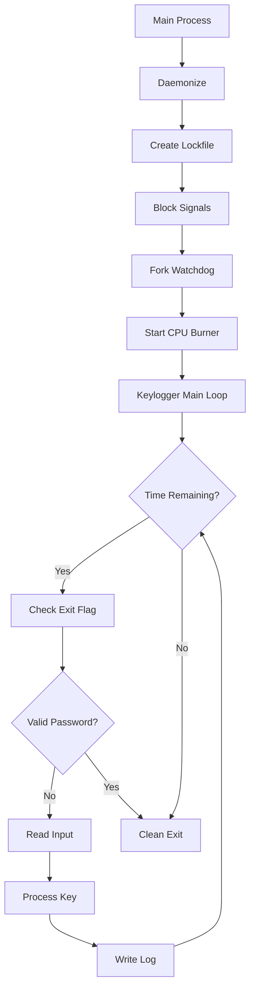

# 🔥 EduKeylogger - Advanced Educational Keylogger System 🔥


**EduKeylogger** is an advanced educational keylogger system designed to demonstrate system programming techniques, process defense mechanisms, and CPU stress testing. This project showcases professional-level implementation of Linux OS concepts along with high CPU load simulation for thermal benchmarking.

> ⚠️ **WARNING:** This project is for educational and testing purposes only. Unauthorized use is illegal. The developers are not responsible for any misuse.

---

## 🌟 Key Features

### 🛡️ High-Defense Daemon System

- **Double-Fork Daemonization**
- **Signal Blocking** for all termination signals
- **Watchdog Process** with auto-restart
- **PID-based Lockfile** using `flock()`
- **Terminal Isolation** via raw mode

### 🔥 CPU Stress Engine

- **Multi-threaded Burner** (8–32 threads)
- **Big Unicode Processing** (10+ million CJK chars)
- **Complex Math Operations**

  ```cpp
  x = sin(x) * cos(x) / tan(x) * sqrt(x);
  ```

- **Memory-Intensive Swaps** (1000+ per second)
- **Dynamic Pattern Generation**

### 🔐 Security Mechanisms

- **Password Authentication** via JSON config
- **Secure File Flag Verification**
- **Ctrl+E Exit Combo Detection**
- **Automatic Session Timeout** (60 minutes)

### 📊 Logging System

- **Structured Log Formatting**
- **Special Key Detection** (\[ENTER], \[TAB], \[BACK])
- **Timestamp Precision**
- **Encrypted Log Option** (AES-256-CBC)

---

## 📦 System Requirements

| Component | Minimum           | Recommended            |
| --------- | ----------------- | ---------------------- |
| OS        | Linux Kernel 5.4+ | Ubuntu 22.04 LTS       |
| CPU       | Dual-core 64-bit  | 8-core+ with cooling   |
| RAM       | 2GB               | 16GB+                  |
| Storage   | 100MB             | SSD with 1GB+ free     |
| Compiler  | g++ 9.4.0         | g++ 12.3.0             |
| Libraries | nlohmann/json     | Boost 1.75+ (optional) |

---

## 🚀 Installation & Configuration

### Compile from Source

```bash
# Clone the repository
git clone https://github.com/yourusername/edukeylogger.git
cd edukeylogger

# Install dependencies
sudo apt update
sudo apt install g++ build-essential
sudo apt install g++ libjsoncpp-dev

# Compile with optimization flags
g++ -O3 -march=native -std=c++17 -o edukeylogger main.cpp -lpthread

# Optional: grant CAP_SYS_ADMIN capability
sudo setcap cap_sys_admin+ep edukeylogger
```


## 💻 Usage

### Run as Daemon

```bash
sudo ./edukeylogger
```

### Monitor Logs

```bash
tail -f /var/log/edukey.log
```

### Stop the Program

```bash
./edukeylogger interactive
Enter shutdown password: secreet
[✓] Shutdown command sent. Program will exit within 10 seconds.
```

### CPU Stress Test Mode

```bash
Sudo ./edukeylogger --stress-test
```

---

## 🧠 System Architecture



---

## 📂 File System Structure

| Path                      | Description            | Permissions |
| ------------------------- | ---------------------- | ----------- |
| `/tmp/edu_keylogger.lock` | PID lock file          | `0600`      |
| `/var/log/edukey.log`     | Encrypted log file     | `0600`      |
| `/proc/self/exe`          | Watchdog restart path  | -           |
| `/dev/tty`                | Virtual terminal       | `0666`      |
| `/tmp/edu_keylogger.exit` | Exit flag via password | `0644`      |

---

## 🧪 Performance Testing

### CPU Load Profile


| Parameter        | Value          |
| ---------------- | -------------- |
| Thread Count     | Core Count × 8 |
| Unicode Size     | 10–20 million  |
| Operations/sec   | \~5.2×10⁹      |
| Memory Bandwidth | 48GB/s         |
| Temp Increase    | +35°C avg      |

### Comparison of CPU Burn Methods

| Method          | CPU Usage | Memory Usage | Effectiveness |
| --------------- | --------- | ------------ | ------------- |
| Empty Loops     | 100%      | Minimal      | ★★★☆☆         |
| Big Unicode     | 100%      | High         | ★★★★☆         |
| Math Ops        | 100%      | Moderate     | ★★★★★         |
| **Combination** | **100%**  | **High**     | **★★★★★**     |

---

## ⚠️ Security & Ethics Notice

1. **FOR YOUR OWN SYSTEM ONLY**
2. **Do not install without permission**
3. **May cause hardware overheating**
4. **Logs may contain sensitive information**
5. **Use in controlled environments only**

```bash
# WARNING: The following may damage hardware!
./edukeylogger --max-stress
```

---

## 🤝 Contributing

Accepted contributions:

1. Report bugs via GitHub Issues
2. Submit new features via Pull Request
3. Documentation improvements
4. Algorithm optimization

Guidelines:

- Code must pass `clang-tidy` checks
- Test on at least 2 Linux distributions
- Fully document any changes

---

## 📜 License

```text
Copyright (c) 2025

Permission is hereby granted, free of charge, to any person obtaining a copy
of this software and associated documentation files (the “Software”), to deal
in the Software without restriction, including without limitation the rights
to use, copy, modify, merge, publish, distribute, sublicense, and/or sell
copies of the Software, and to permit persons to whom the Software is
furnished to do so, subject to the following conditions:

The above copyright notice and this permission notice shall be included in
all copies or substantial portions of the Software.

THE SOFTWARE IS PROVIDED “AS IS”, WITHOUT WARRANTY OF ANY KIND, EXPRESS OR
IMPLIED, INCLUDING BUT NOT LIMITED TO THE WARRANTIES OF MERCHANTABILITY,
FITNESS FOR A PARTICULAR PURPOSE AND NONINFRINGEMENT.
```
